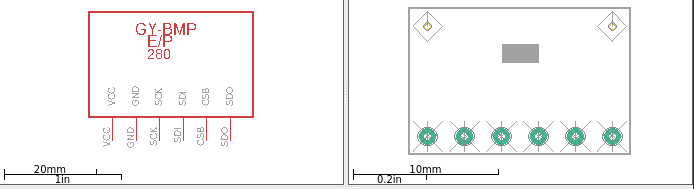

# GY-BMP/E 280
This repo has the lbr file for the GY-BMP/E 280 (Chinese BMP280) for your
Eagle designs. If you like it give it a star :).

**WARNING**: This schematic has not been use for real world PCBs, so
please check that the dimensions are correct. I'm not responsabible
for any problem related for bad use of this library. 
